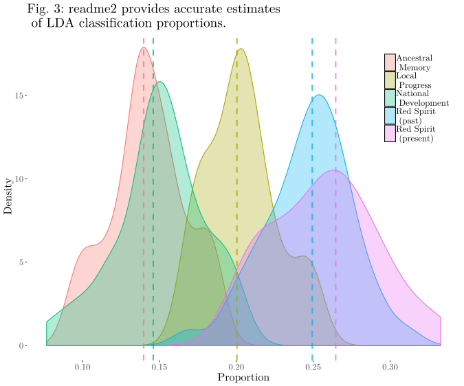

# Unsupervised Text Classification With Chinese Social Media

I replicate and extend “[How the Chinese Government Fabricates Social Media Posts for Strategic Distraction, not Engaged Argument
](https://gking.harvard.edu/50c)” by King, Pan, and Roberts (2017).

The paper uses an [updated version](https://github.com/iqss-research/readme-software) of the readme software (“readme2”) by [Jerzak, King, and Strezhnev (2019)](https://gking.harvard.edu/words) in conjunction with latent Dirichlet allocation (LDA), a method for unsupervised text classification, to test readme2’s performance on an automatically classified set of Chinese social media posts. Using the replication data provided on the [Harvard Dataverse](https://dataverse.harvard.edu/dataset.xhtml?persistentId=doi:10.7910/DVN/QSZMPD) and the original five-topic classification scheme, it finds strong support for the authors’ original conclusions. It also proposes a new approach for automatically estimating classifications in large corpora when total classification is infeasible with certain machine learning methods.

To replicate my results, knit `final_writeup.Rmd` (with the `results` folder) or see `final_writeup.Rmd`.

